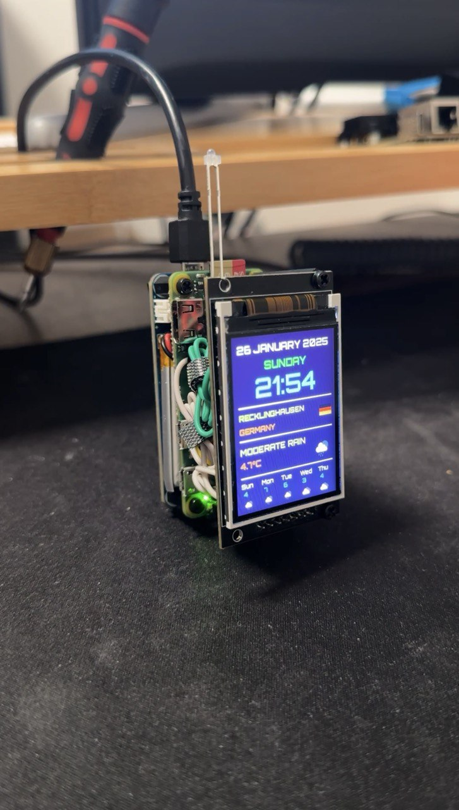

# 🌤️ Raspberry Pi Weather Display System

> A beautiful, real-time weather display for your Raspberry Pi with ST7789 TFT screen and LED indicators

## 📸 Project Demo

<div align="center">

### 📱 Display Screenshots



</div>

---

## 📖 Table of Contents
- [📸 Project Demo](#-project-demo)
- [✨ Features](#-features)
- [🛠️ Hardware Requirements](#️-hardware-requirements)
- [⚡ Quick Start](#-quick-start)
- [📋 Detailed Installation](#-detailed-installation)
- [🔧 Configuration](#-configuration)
- [🎮 Usage](#-usage)
- [🔍 Troubleshooting](#-troubleshooting)
- [🤝 Contributing](#-contributing)

---

## ✨ Features

🌡️ **Real-time Weather Display** - Current conditions with temperature and weather icons  
📍 **Auto Location Detection** - Uses IP-based geolocation to find your location  
📅 **5-Day Weather Forecast** - Weekly weather preview with temperatures and icons  
🕐 **Time & Date Display** - Current time and date with custom Orbitron font  
🏳️ **Country Flag Display** - Shows your country's flag next to location info  
💡 **LED Status Indicators** - Visual status indicators with customizable patterns  
🔄 **Auto Recovery** - Robust error handling with automatic restart mechanisms  
⚙️ **System Service** - Runs automatically on boot as a systemd service  

---

## 🛠️ Hardware Requirements

### 📦 Components Needed
| Component | Description | Quantity |
|-----------|-------------|----------|
| 🥧 Raspberry Pi | 3B+ or newer recommended | 1 |
| 📺 ST7789 Display | 240x320 pixels TFT screen | 1 |
| 💚 Green LED | 5mm standard LED | 1 |
| ❤️ Red LED | 5mm standard LED | 1 |
| 🔌 220Ω Resistors | For LED current limiting | 2 |
| 🔗 Jumper Wires | Male-to-female recommended | 10+ |
| 🍞 Breadboard | Half-size (optional) | 1 |

### 🔌 Pin Connections

#### 📺 ST7789 Display Wiring
| Display Pin | Raspberry Pi Pin | Description |
|-------------|------------------|-------------|
| **VCC** | 3.3V (Pin 1 or 17) | Power supply |
| **GND** | GND (Pin 6, 9, 14, 20, 25, 30, 34, 39) | Ground |
| **CS** | GPIO 8 (Pin 24) | SPI Chip Select |
| **DC** | GPIO 25 (Pin 22) | Data/Command |
| **RST** | GPIO 24 (Pin 18) | Reset |
| **SDA** | GPIO 10 (Pin 19) | SPI Data (MOSI) |
| **SCL** | GPIO 11 (Pin 23) | SPI Clock |

#### 💡 LED Wiring
| LED | Connection | GPIO Pin |
|-----|------------|----------|
| **🟢 Green LED** | Long leg → 220Ω → GPIO 17 (Pin 11)<br>Short leg → GND | GPIO 17 |
| **🔴 Red LED** | Long leg → 220Ω → GPIO 27 (Pin 13)<br>Short leg → GND | GPIO 27 |

<div align="center">

<p><em>Example of the completed hardware setup</em></p>
</div>

---

## ⚡ Quick Start

### 🚀 One-Command Installation

```bash
# 1. Clone the repository
git clone https://github.com/ssnrshnn/skyforge_project.git
cd raspberry-pi-weather-display

# 2. Run automated setup
chmod +x setup.sh && ./setup.sh
```

### ✅ What the Setup Script Does
- ✅ Updates your Raspberry Pi system
- ✅ Installs all required dependencies
- ✅ Enables SPI interface automatically
- ✅ Configures systemd service
- ✅ Sets up fonts and project files
- ✅ Tests hardware connections (optional)
- ✅ Starts the weather display service

**🎉 That's it! Your weather display will be running automatically.**

<div align="center">

<p><em>Your weather display system in action!</em></p>
</div>

---

## 🔧 Configuration

### 🌤️ Weather API Setup

> **🔑 Required:** This project needs a free OpenWeatherMap API key

1. **Get your free API key:**
   - 🌐 Visit [OpenWeatherMap API](https://openweathermap.org/api)
   - 📝 Sign up for a free account
   - 🔑 Generate your API key (free tier: 1000 calls/day)

2. **Configure the API key:**
   - **Automated setup:** You'll be prompted during `./setup.sh`
   - **Manual setup:** Edit `weather_display.py` and replace `YOUR_API_KEY_HERE`:
   ```python
   WEATHER_API_KEY = "your_actual_api_key_here"
   ```

> ⚠️ **Important:** The weather display won't work without a valid API key

### ⚙️ Customization Options

<details>
<summary>🎨 Click to see customization options</summary>

#### Display Settings (`weather_display.py`)
- **Update Interval:** Change `time.sleep(60)` for different refresh rates
- **Font Sizes:** Adjust font size variables for text elements
- **Colors:** Modify color values in drawing functions
- **Cache Duration:** Change `CACHE_DURATION` for API call frequency

#### LED Patterns (`led_controller.py`)
- **Blink Timing:** Adjust `time.sleep()` values in main loop
- **LED Pins:** Change `LED1_PIN` and `LED2_PIN` for different GPIO pins
- **Blink Pattern:** Modify `blink_twice()` function for custom patterns

</details>

---

## 🎮 Usage

### 🖥️ Service Management

```bash
# Check service status
sudo systemctl status weather-display.service

# View real-time logs
sudo journalctl -u weather-display.service -f

# Control the service
sudo systemctl start weather-display.service    # Start
sudo systemctl stop weather-display.service     # Stop
sudo systemctl restart weather-display.service  # Restart
```

### 🔧 Manual Operation

```bash
# Run the complete system
python3 system_controller.py

# Run only weather display
python3 weather_display.py

# Run only LED control
python3 led_controller.py
```

### 📁 File Structure

```
📦 raspberry-pi-weather-display/
├── 🎛️ system_controller.py    # Main system controller with process management
├── 🌤️ weather_display.py      # Weather display functionality
├── 💡 led_controller.py       # LED control functionality
├── 🔤 Orbitron-Bold.ttf       # Custom font file
├── ⚙️ weather-display.service # Systemd service configuration
├── 🚀 setup.sh               # Automated installation script
├── 🛡️ .gitignore             # Git ignore file for security
├── 📖 README.md              # This file
└── 📸 Images/                # Project photos and videos
    ├── 2.jpg                 # Hardware setup photo
    ├── 3.jpg                 # Display screenshot
    ├── 5.mp4                 # Hardware demo video
    ├── 6.mp4                 # LED controller demo
    ├── 7.mp4                 # Weather display demo
    └── 9.mp4                 # Complete system demo
```

---

## 🔍 Troubleshooting

### ❌ Common Issues

<details>
<summary>📺 Display not working</summary>

- ✅ Check SPI is enabled: `lsmod | grep spi`
- ✅ Verify wiring connections
- ✅ Ensure 3.3V power (not 5V!)
- ✅ Test with: `sudo systemctl status weather-display.service`

</details>

<details>
<summary>💡 LEDs not blinking</summary>

- ✅ Verify GPIO pin connections
- ✅ Check resistor values (220Ω)
- ✅ Ensure proper LED polarity (long leg = positive)
- ✅ Test manually: `python3 led_controller.py`

</details>

<details>
<summary>🌐 Weather data not loading</summary>

- ✅ Check internet connection
- ✅ Verify API key validity
- ✅ Check firewall settings
- ✅ Test API key: `curl "http://api.openweathermap.org/data/2.5/weather?q=London&appid=YOUR_API_KEY"`

</details>

<details>
<summary>🔤 Font not loading</summary>

- ✅ Ensure font file is in `/usr/share/fonts/truetype/`
- ✅ Run `sudo fc-cache -fv` to refresh font cache
- ✅ Check file permissions

</details>

### 📊 Performance Info

| Metric | Value |
|--------|-------|
| 💾 Memory Usage | ~50-100MB RAM |
| 🖥️ CPU Usage | <5% on Pi 4 |
| 🌐 Network Usage | ~1MB/hour |
| 🔄 Update Frequency | Every 60 seconds |

### 📝 Log Files

```bash
# System logs
sudo journalctl -u weather-display.service

# Real-time monitoring
sudo journalctl -u weather-display.service -f
```

---

## 🔒 Security Notes

- 🔐 **Never commit API keys** to version control
- 🤐 **Keep your API key private** - don't share it publicly
- 🌍 **Use environment variables** for production deployments
- 🔄 **Regularly rotate your API keys** for better security
- 🛡️ The included `.gitignore` file helps prevent accidental commits

---

## 🌐 API Usage

This system uses these APIs:
- **🌤️ OpenWeatherMap:** Current weather and 5-day forecast
- **📍 IP-API:** Automatic location detection
- **🏳️ FlagCDN:** Country flag images

---

## 🤝 Contributing

We welcome contributions! Here's how you can help:

1. 🍴 Fork the repository
2. 🌿 Create a feature branch (`git checkout -b feature/amazing-feature`)
3. 💾 Commit your changes (`git commit -m 'Add amazing feature'`)
4. 📤 Push to the branch (`git push origin feature/amazing-feature`)
5. 🔄 Open a Pull Request

---

## 📄 License

This project is open source. Please respect the terms of service of the APIs used.

---

## 🙏 Acknowledgments

- 🌤️ **OpenWeatherMap** for weather data API
- 🔧 **Adafruit** for the display libraries
- 🏳️ **FlagCDN** for country flag images
- 🔤 **Google Fonts** for the Orbitron font family

---

<div align="center">

**⭐ If this project helped you, please give it a star! ⭐**

Made with ❤️ for the Raspberry Pi community

</div> 